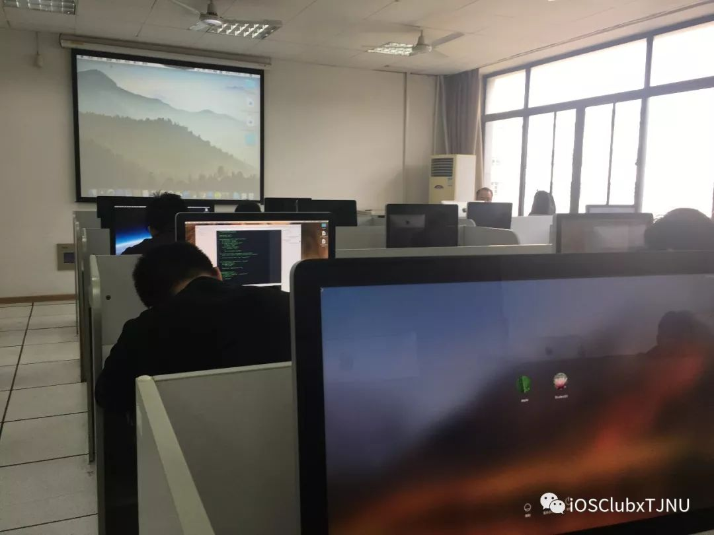
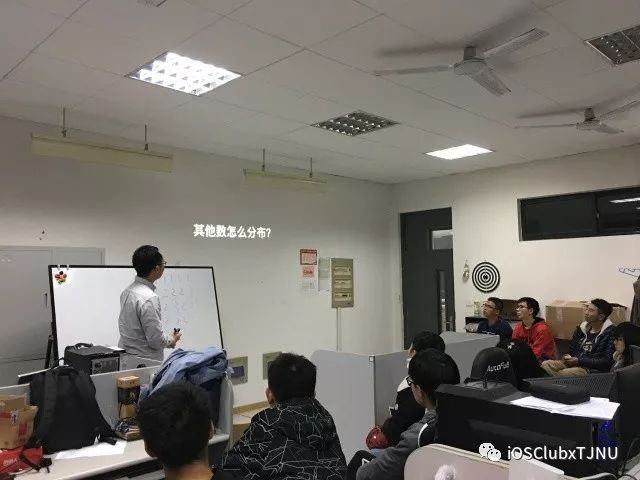
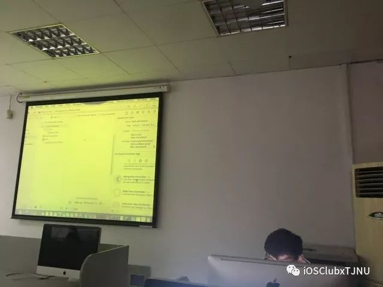
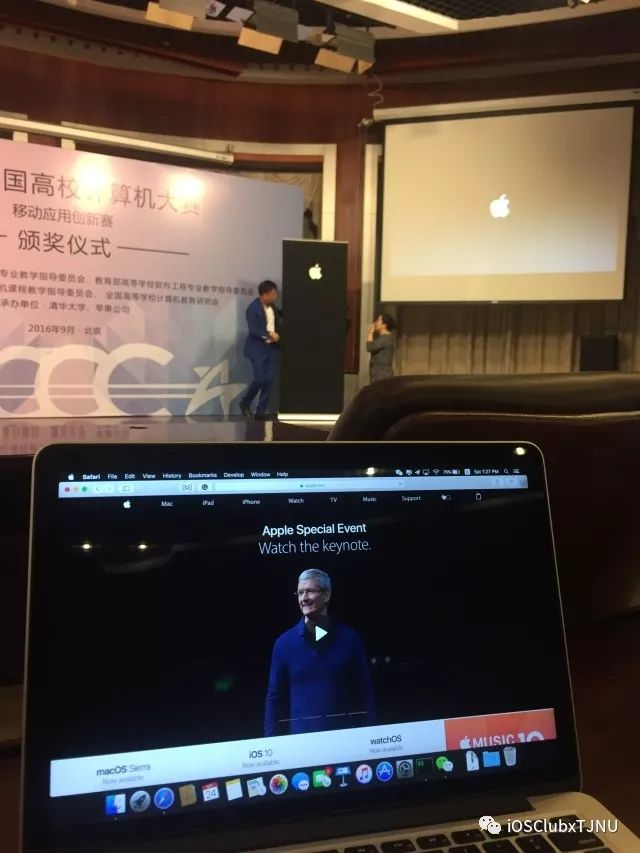
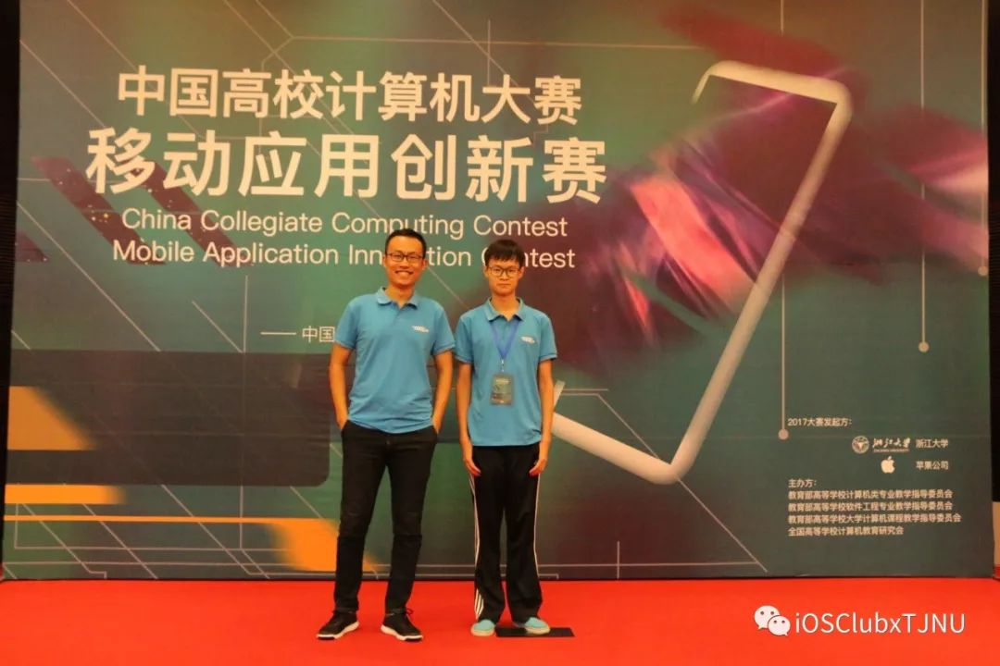
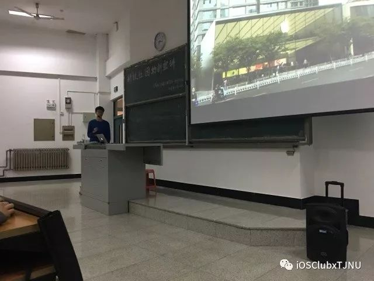

[点击阅读原文](https://mp.weixin.qq.com/s/zlMQglZ6ncBGCh2i9uHpLA)

天津师范大学的 iOS Club 承办于2017年9月，拥有良好的教育资源与硬件资源。

2017开学期间招募并选拔了积极踊跃的学生团体并初次确定 Core Member。我们以项目为核心进行学习，并由多位开发者举办 Session 普及开发方面的知识，并定期组织优秀学生进行自身的开发经验分享。

在线下，我们也曾与 Apple Store 联系并参与官方组织的编程活动，并正在与 Apple 官方合作，争取将社团打造成能让 Apple 认证 的 官方社团。

经过2017级的学期审查，学生们均有不同程度的进步，本社团因此呈现了从创办以来的上升趋势，并有信心将势头保持延续。

### 初代讲师介绍

#### 赵一勤-社长

赵一勤，软件工程专业2015级。天津师范大学 iOS Club 第一届社长兼主要讲师，创新创业工作室成员，与本校计算机与信息工程学院老师有多次项目合作开发经验。曾参与2016 年中国高校计算机大赛-移动应用创新赛，获得艺术设计类专项奖及全国三等奖，参赛作品：iOS 平台的团队管理软件，软件紧密结合 iOS 生态，设计了一套小型团队消息通知，团队管理系统。

#### 刘靖禹-副社长

刘靖禹，计算机科学与技术专业2016级。本校 iOS Club 副社长兼讲师，创新创业工作室骨干成员，天津市级大学生创新创业项目技术骨干。iOS开发者，熟练使用 Swift 与 Objective-C。曾与社长赵一勤共同参与 2017 中国高校计算机大赛-移动应用创新赛 并获得三等奖，参赛作品：关注心理健康的减压软件，本软件与我校心理与行为研究学院共同设计，意指用移动平台帮助人们更好的了解自己的心理，并缓解生活压力。

以上二人在备战2017年移动应用创新赛的暑假中去广东东莞参与了当年的 iOS Club 夏令营活动，并萌生了将 iOS Club 作为技术社团引入本校的想法，并迅速在新学期开始时向学校提出申请并迅速建设，在本校院学生会下科协招纳新生时举办宣讲会，讲述新奇又向鼓舞人心的 iOS 开发的旅程得到学生们的热烈反馈。

一路走来，iOS Club 所举办过的 Session 记录与项目代码已完整的收录在 **GitHub TJNU iOS Club** ，我们鼓励学生进行日常的学习交流并经常分享技术文档。我们会不断积累学习资源与管理经验，带着勿忘初衷的热情，培养出优秀的 iOS 开发者并引导其**不断创新。**

