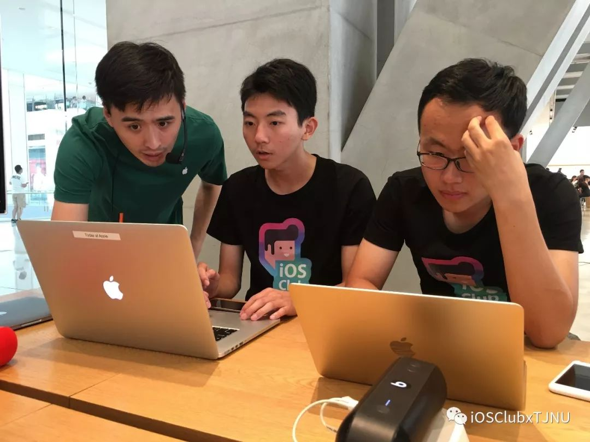
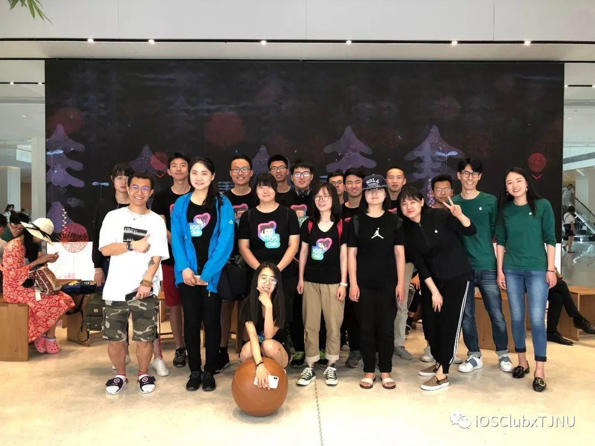

[点击阅读原文](https://mp.weixin.qq.com/s/_pIxm6f38aIV6OUz2KQbAg)

6月2日，坐标天津恒隆广场 ，有一家种树的 Apple Store。

这天，统一着装的我们参与了 Apple Store 定期举办的互动课程：创意工坊。

这场别开生面的互动课程时长 90 分钟，主要讲述了 Final Cut Pro X 这款视频剪辑软件的基本操作，多机位剪辑和关键帧的使用。Apple store 为 iOS Club 的我们开辟了一块空间进行授课，无论是在基础使用或提高效率上，富有经验的Creative 培训师都给我们分享了许多专业技巧，令我们大开眼界。而对于课程中遇到的问题，同学们积极钻研提问，最终都制作出了自己的作品，完成了课程学习。这次对新知识的探索令每位同学都收获颇丰。

课后，同学们也分别逛了自己感兴趣的产品区。作为一个 iOS 开发者，怎么会对闪闪发光的“开发工具”无动于衷。

还有这个。。。。。。

这是天津师范大学 iOS Club 第一次全体的课外活动，也给属于我们的第一年留下了一个完美的句点。

**希望我们能秉持初心，一起让这个团体走的越来越远。**

感谢恒隆 Apple Store 对天师大 iOS Club 本次活动的支持，感谢几位活泼的讲师小哥哥小姐姐为我们耐心地答疑解惑。
Apple Store 会定期发布更多更有趣的活动等着大家来参与，如果你有兴趣参加，可以查看 [官网](https://www.apple.com/cn/today/)。
联系我们告知你的想法，让我们一起把想法赋予行动。

