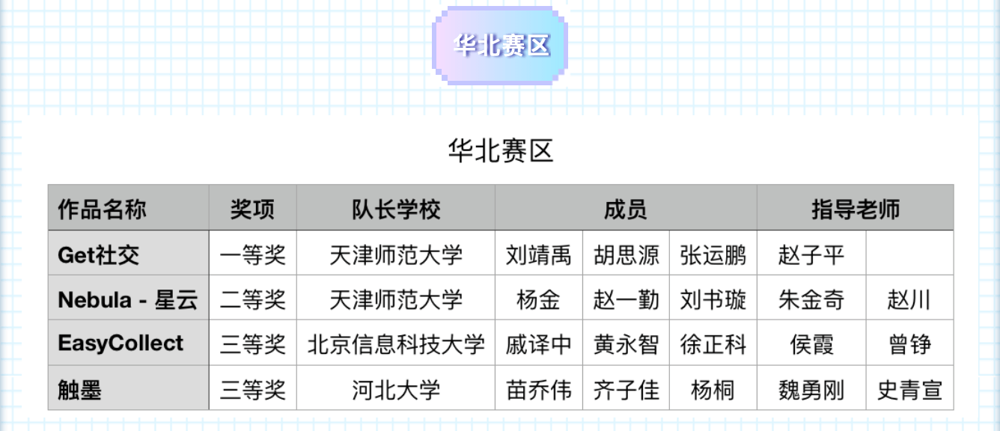

经历过海选、复赛、决赛长达六个月的赛程，中国高校计算机大赛第四届移动应用创新赛 (CCCC) 在 2019 年 10 月 28 日圆满结束。
本次大赛共有一千二百多支队伍参赛，这是一场来自五湖四海的盛大的头脑风暴，每一个队伍都发挥着自己的奇思妙想，致力于解决不同领域的各种问题。

本次，来自 TJNU iOS Club 的 Get 团队由计算机16级学生--刘靖禹和软件16级学生--胡思源、张运鹏组成，在赵子平老师的指导下，以《Get 社交》作品
荣获华北赛区一等奖。

目前《Get 社交》已开发完成，上架至 App Store，点击[连接](https://apps.apple.com/cn/app/get%E7%A4%BE%E4%BA%A4/id1439169281)下载体验~

同样来自 TJNU iOS Club 的 CountingStars 团队由软件17级学生--杨金、刘书璇和软件15级学生--赵一勤组成，在朱金奇老师和赵川老师的指导下，以
《Nebula-星云》作品荣获华北赛区二等奖。

《Nebula-星云》目前还处于开发状态，敬请期待～

本届赛事，TJNU iOS Club 包揽华北赛区一、二等奖，为社团历史添上新的一篇华章！期待所有社团成员再接再厉，在来年的移动应用创新赛创造更精彩的战绩～
